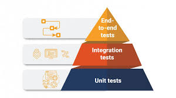

# Test Automatici

Abbiamo scritto tanto codice e sembra funzionare... Ma come possiamo essere certi che tutto continuerà a girare correttamente nel tempo? Certo, i test manuali sono utili: esegui l’applicazione, clicchi qua e là, e tutto sembra andare bene. Ma cosa succede quando, dopo mesi, aggiungiamo nuove funzionalità o modifichiamo qualcosa? Siamo sicuri che non stiamo rompendo parti del codice già funzionante?  

Ecco dove entrano in gioco i test automatici: ci permettono di verificare il corretto funzionamento del codice **senza dover ripetere manualmente le stesse operazioni ogni volta**. E se qualcosa si rompe? I test ce lo diranno subito!


## Cosa sono i Test e a Cosa Servono

I **test** sono un processo fondamentale per verificare che il software sviluppato soddisfi i requisiti richiesti e funzioni come previsto. I test automatizzati servono a garantire che il codice sia affidabile e privo di bug, e permettono di individuare eventuali errori in maniera preventiva, evitando che raggiungano l'ambiente di produzione.

I test possono avere diversi scopi, tra cui:
- **Verifica di correttezza**: Assicurarsi che il codice funzioni correttamente.
- **Prevenzione di regressioni**: Identificare problemi introdotti da nuove modifiche al codice.
- **Miglioramento della qualità**: Aumentare la stabilità e la qualità del software grazie a un feedback continuo.

## Tipi di Test: Qual è la Differenza?  
Non tutti i test sono uguali. Esistono vari tipi di test, ognuno con uno scopo ben preciso. Implementarli tutti aiuta a garantire che il software funzioni correttamente da ogni punto di vista.  

### 1. Unit Test (Test Unitari)  
- **Scopo:** Testano **una singola unità** di codice, come un metodo o una classe.  
- **Caratteristiche:** Veloci, isolati, facili da scrivere e mantenere.  
- **Esempio:** Un test che verifica che il metodo `calcolaSconto` ritorni il valore corretto dato un certo prezzo e una percentuale di sconto.  
- **Strumenti:** JUnit 5, Mockito.  

**Perché sono importanti?**  
Garantiscono che i mattoni fondamentali del software funzionino come previsto.  

---

### 2. Integration Test (Test di Integrazione)  
- **Scopo:** Verificano che **più componenti lavorino correttamente insieme**.  
- **Caratteristiche:** Testano flussi completi tra classi, servizi e repository, spesso utilizzando un database o API reali.  
- **Esempio:** Verifica che `UserService` recuperi i dati corretti da un database.  
- **Strumenti:** Spring Boot, Testcontainers.  

**Differenza chiave con i Unit Test:**  
- **Unit Test**: Componenti isolati con mock.  
- **Integration Test**: Flussi reali tra componenti senza mock.  

---

### 3. End-to-End Test (E2E)  
- **Scopo:** Testano l’intero flusso dell’applicazione, **dalla UI al database**.  
- **Caratteristiche:** Simulano il comportamento dell'utente, eseguendo l'applicazione come se fosse in produzione.  
- **Esempio:** Un test che verifica che un utente possa registrarsi, accedere e visualizzare il proprio profilo.  
- **Strumenti:** Selenium, Cypress, Playwright.  

**Perché sono importanti?**  
Garantiscono che tutte le parti del sistema funzionino insieme come previsto.  

---

### 4. Performance Test  
- **Scopo:** Misurano la **velocità, stabilità e reattività** del sistema sotto carico.  
- **Caratteristiche:** Simulano un grande numero di utenti o richieste simultanee.  
- **Esempio:** Test che verifica che un’API risponda in meno di 300ms con 100 utenti simultanei.  
- **Strumenti:** JMeter, Gatling, k6.  

**Perché sono importanti?**  
Aiutano a identificare colli di bottiglia e a ottimizzare l’applicazione.  

---
### Altri Tipi di Test  

- **Security Test** – Simulano attacchi per scoprire falle di sicurezza (SQL Injection, XSS).  
  *Strumenti:* OWASP ZAP, Burp Suite.  

- **Regression Test** – Ri-eseguono i test esistenti per assicurarsi che nuove modifiche non rompano funzionalità già presenti.  
  *Strumenti:* JUnit, Selenium.  

- **Smoke Test** – Verificano che l’app si avvii e le funzionalità principali siano operative dopo il deploy.  
  *Strumenti:* Postman, JUnit.  

- **Acceptance Test** – Validano che il software soddisfi i requisiti richiesti dal cliente, spesso scritti con i product owner.  
  *Strumenti:* Cucumber, FitNesse.  

## Gerarchia dei Test

Immagina una piramide: la base è ampia e solida, mentre la cima è più stretta e leggera. Questa è l'immagine perfetta per rappresentare la **piramide dei test**, un concetto fondamentale nello sviluppo software.  

- **Alla base** troviamo i **Unit Test** – molti, veloci e semplici. Rappresentano la maggior parte dei test, coprono singole funzioni o metodi e garantiscono che ogni pezzo del codice funzioni in isolamento.  

- **Al centro** ci sono i **Test di Integrazione** – meno numerosi, ma cruciali per verificare che i diversi componenti dell'app lavorino bene insieme. Sono più lenti dei test unitari perché coinvolgono più parti del sistema.  

- **In cima** troviamo i **Test End-to-End (E2E)** – pochi e complessi, simulano il comportamento dell'utente finale testando l'intero sistema dall'inizio alla fine. Sono i più lenti, ma garantiscono che tutto funzioni correttamente in uno scenario reale.  

**Obiettivo della piramide?**  
**Scrivere molti test unitari, meno test di integrazione e pochissimi E2E.** Questo garantisce velocità e affidabilità nei test, riducendo i tempi di esecuzione e mantenendo il sistema stabile e ben coperto.  

  
## Test in Spring Boot: Come Implementarli

### 1. Unit Test in Spring Boot  
I **Unit Test** in Spring Boot si concentrano su singole classi o metodi, come servizi (`Service`), controller (`Controller`) o repository. Vengono eseguiti **senza caricare il contesto Spring**, il che li rende rapidi ed efficienti.  

**Strumenti:**  
- **JUnit 5** per definire i test.  
- **Mockito** per simulare dipendenze (es. repository o altri servizi).  

**Esempio di Unit Test:**  
```java
@ExtendWith(MockitoExtension.class)
class UserServiceTest {

    @Mock
    private UserRepository userRepository;

    @InjectMocks
    private UserService userService;

    @Test
    void shouldReturnUserWhenIdIsValid() {
        User user = new User(1L, "John Doe");
        Mockito.when(userRepository.findById(1L)).thenReturn(Optional.of(user));

        User result = userService.getUserById(1L);

        assertNotNull(result);
        assertEquals("John Doe", result.getName());
    }
}
```  
**In questo test:**  
- **@Mock** crea una versione simulata di `UserRepository`.  
- **@InjectMocks** inietta il mock in `UserService`.  
- **when...thenReturn** simula il comportamento del repository.  

I test unitari coprono la **logica di business** e garantiscono che ogni metodo faccia ciò che deve senza coinvolgere altre parti del sistema.  

---

### 2. Integration Test in Spring Boot  
I **Test di Integrazione** verificano che più componenti lavorino insieme, come ad esempio un servizio che interagisce con un database tramite repository. A differenza dei test unitari, qui si carica il **contesto Spring reale** utilizzando l'annotazione `@SpringBootTest`.  

**Strumenti:**  
- **@SpringBootTest** per caricare l'intero contesto Spring.  
- **Testcontainers** per testare con database Dockerizzati.  
- **H2** per eseguire test su database in memoria.  

**Esempio di Integration Test:**  
```java
@SpringBootTest
class UserServiceIntegrationTest {

    @Autowired
    private UserService userService;

    @Autowired
    private UserRepository userRepository;

    @Test
    void shouldRetrieveUserFromDatabase() {
        User user = new User(1L, "John Doe");
        userRepository.save(user);

        User result = userService.getUserById(1L);

        assertNotNull(result);
        assertEquals("John Doe", result.getName());
    }
}
```  
**In questo test:**  
- **@SpringBootTest** avvia l’intera applicazione.  
- **@Autowired** inietta i bean reali (`UserService` e `UserRepository`).  
- Il test simula un'operazione reale su database.  

Gli integration test sono utili per validare **flussi tra componenti**, come la persistenza dei dati o chiamate a servizi REST.  

---

### 3. End-to-End (E2E) Test in Spring Boot  
I **Test End-to-End** coprono l'intero ciclo di vita dell'applicazione, simulando il comportamento dell'utente finale. Questo tipo di test esegue la **Spring Boot Application completa** e verifica che tutto funzioni come in produzione.  

**Strumenti:**  
- **Selenium** o **Cypress** per automatizzare interazioni con l'interfaccia utente.  
- **RestAssured** per testare API REST in modo programmatico.  
- **Docker** per simulare ambienti reali.  

**Esempio di E2E Test (API REST):**  
```java
@SpringBootTest(webEnvironment = SpringBootTest.WebEnvironment.RANDOM_PORT)
@AutoConfigureMockMvc
class UserApiTest {

    @Autowired
    private MockMvc mockMvc;

    @Test
    void shouldReturnUserDetails() throws Exception {
        mockMvc.perform(get("/users/1"))
                .andExpect(status().isOk())
                .andExpect(jsonPath("$.name").value("John Doe"));
    }
}
```  
**In questo test:**  
- **MockMvc** simula chiamate HTTP.  
- **@SpringBootTest** avvia l'app su una porta casuale per simulare un ambiente reale.  
- Si verifica che l'API risponda correttamente con dati JSON attesi.  

I test E2E simulano l'esperienza dell'utente, garantendo che **tutti i componenti lavorino insieme** correttamente.  

---

### Come Mantenere un Buon Equilibrio  
- **80% Unit Test** – Sono la base, veloci e coprono gran parte del codice.  
- **15% Integration Test** – Validano che i componenti comunichino tra loro.  
- **5% E2E Test** – Pochi, ma cruciali per testare l'intero sistema.  

Con questa piramide ben bilanciata, il tuo progetto Spring Boot sarà **robusto, testato e pronto per la produzione**.  

## Collegamenti Esterni

Per ulteriori approfondimenti, puoi consultare i seguenti collegamenti:

- [JUnit 5 User Guide](https://junit.org/junit5/docs/current/user-guide/)
- [Mockito Documentation](https://site.mockito.org/)
- [Spring Boot Testing](https://docs.spring.io/spring-boot/docs/current/reference/html/features.html#features.testing)
- [SeleniumHQ Browser Automation](https://www.selenium.dev/)
- [Apache JMeter](https://jmeter.apache.org/)

## Conclusione

I test automatizzati sono essenziali per mantenere la qualità del software e prevenire regressioni. Gli **Unit Testing** garantiscono che le singole parti del codice funzionino correttamente, gli **Integration Testing** verificano l'interazione tra i moduli, gli **End-to-end Testing** simulano il comportamento dell'utente finale e i **Test di Performance e Stress Testing** assicurano che il sistema funzioni correttamente sotto carico. Utilizzando strumenti come **JUnit**, **Mockito**, **Selenium** e **JMeter**, possiamo costruire un processo di testing completo e affidabile, garantendo che il software risponda alle aspettative degli utenti finali.
